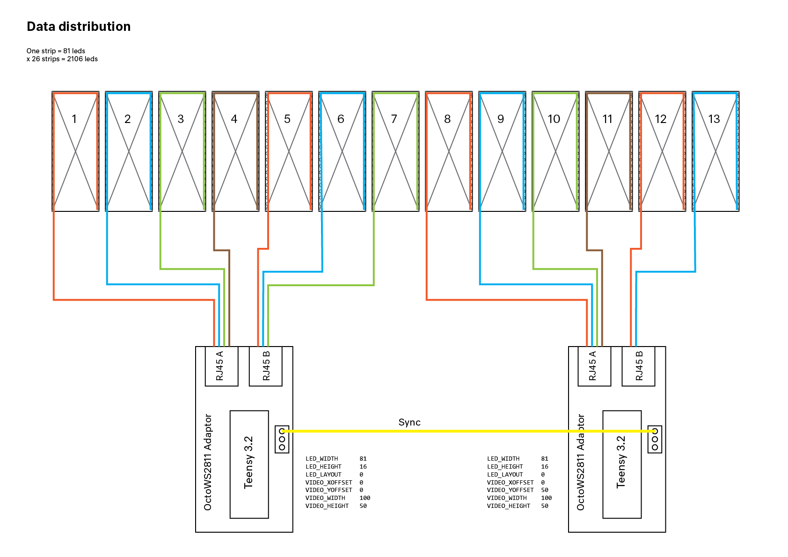
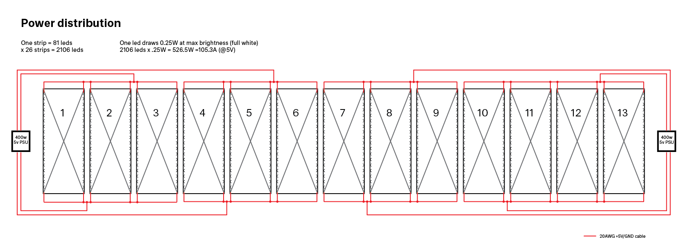
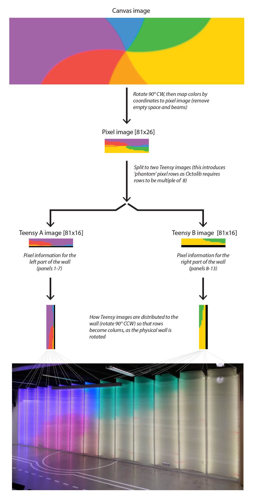

# Sensor Lab Video wall

## About
This is the code that drives the video wall in the Sensor Lab event space. It's 
using WS2812b leds driven by the [OctoWS2811 LED Library](https://www.pjrc.com/teensy/td_libs_OctoWS2811.html) 
running on two [Teensy 3.2 boards](https://www.pjrc.com/store/teensy32.html) both by [Paul J. Stoffregen](https://www.pjrc.com). 

The project is divided in the two firmwares for the two Teensies (in (/firmware)),
which is the same Arduino program, just with different settings. Then there is the
client software (in (/client)) that provides the Teensies with data to send to the leds. This software
is a [Processing](https://processing.org/) application (built using Eclipse), that 
contains several PApplet sketches, and then converts their output to a format that 
can be sent to the Teensies. This client software is based on PJRC's 
[VideoDisplay Processing software](https://github.com/PaulStoffregen/OctoWS2811/tree/master/extras/VideoDisplay/Processing).

## Wall hardware

The wall hardware consists of 26 WS2812b  strips of 81 leds each, distributed over
13 panels (one strip on each side of the panels). The data for the leds is supplied
by two [Teensy 3.2 boards](https://www.pjrc.com/store/teensy32.html), each being 
responsible for about half of the wall. The data is supplied via CAT5e cables through 
OctoWS2811 adapter boards.

Power is supplied by two 400W power supplies, each again bing responsible for about\
half of the wall. Power is supplied to the led strips both from the top and bottom
by 20 AWG power cable.

## Creating animations and pixel mapping

